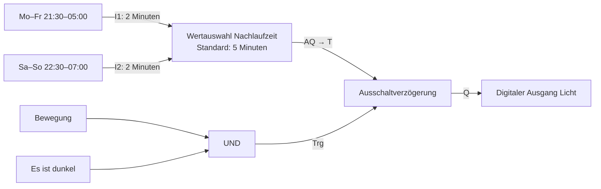

# Werte und variable Nachlaufzeiten

Ab Nodivra 0.14 / Runtime 0.4. Die lokale Simulation benötigt keine Verbindung zur Runtime.

## Bausteine für das Nachtlicht

1. Zwei **Wochenschaltuhr / Zeitfenster** aus der Gruppe Schaltuhren:
   - Mo–Fr, 21:30–05:00.
   - Sa–So, 22:30–07:00.
2. **Wertauswahl** unter Analogfunktionen. Zwei Eingänge wählen, „Werte als: Zeit“. Beide Eingänge auf 2 Minuten und den Standardwert auf 5 Minuten stellen. Den Block zum Beispiel „Nachlaufzeit“ nennen. Die beiden Zeitfenster mit I1 und I2 verbinden.
3. **Ausschaltverzögerung**: Zeitvorgabe → **Wert über T**. Den AQ-Ausgang der Wertauswahl mit **T** verbinden.
4. Bewegung und „Es ist dunkel“ über **UND** mit **Trg** verbinden. Q mit dem digitalen Lichtausgang verbinden.

Der Standardwert von 5 Minuten gilt, wenn beide Zeitfenster Aus sind. Die Dunkelheitsbedingung steuert die Freigabe am Trg-Eingang. Tagsüber wird durch neue Bewegung kein Nachlauf gestartet; ein bereits gestarteter Nachlauf kann bis zu seinem Ende weiterlaufen. Für sofortiges Ausschalten bei Helligkeit kann „nicht dunkel“ an R angeschlossen werden.

Die Wochentage beziehen sich wie bisher auf den **aktuellen Kalendertag**, auch nach Mitternacht: Samstag früh gilt das Wochenendfenster bis 07:00; Montag früh das Wochenfenster bis 05:00. Zeiten sind in der Zeitzone des Programms. Die Startzeit ist eingeschlossen, die Endzeit ausgeschlossen.

## Variable beziehungsweise Analogmerker

Für den direkten Datenfluss genügt der benannte Wertauswahl-Block. Soll der Wert ausdrücklich in einem Merker stehen, ergänze **Analogmerker AM** zwischen Wertauswahl und T. Sein Ausgang kann mehrere Verbraucher versorgen. Über „Kontakt zu diesem Merker hinzufügen“ lassen sich zusätzliche Analogkontakte an anderen Stellen im Programm platzieren.

AM und seine Kontakte liefern stets denselben gespeicherten Wert aus dem vorherigen Zyklus (typisch 100 ms). Der Startwert ist 0; keine Speicherung über einen Neustart. Für die aktuelle Zeitbedingung ohne diesen zusätzlichen Speicherzyklus AQ direkt an T anschließen. Mehrere getrennte Schreiber für denselben Merker gibt es nicht; die Wertauswahl legt die Priorität an einer Stelle fest.

## Eindeutiges Verhalten

- Zwei bis acht unabhängige Eingänge. Der erste aktive Eingang nach Nummer bestimmt den Wert. Die Beschriftung am Anschluss zeigt den eingestellten Wert.
- Kein Eingang aktiv: Standardwert. Freie Anschlüsse gelten als Aus. Ist eine höher priorisierte Bedingung unbekannt, bleibt auch AQ unbekannt; ein niedrigerer Eingang darf das nicht verdecken.
- „Zeit“ bietet Stunden/Minuten/Sekunden; AQ führt immer Sekunden. „Zahl“ erlaubt allgemeine Zahlenwerte. Der Multiplexer bleibt für binäre S1/S2-Auswahl separat erhalten; die Bedienung der Wertauswahl erfolgt mit unabhängigen Bedingungen.
- T wird bei Einschaltverzögerung und Zeitimpuls mit der steigenden Trg-Flanke übernommen. Bei Ausschaltverzögerung mit der fallenden Flanke, wenn der Nachlauf beginnt. Änderungen am gewählten Wert verschieben eine bereits gestartete Zeit nicht.
- Erneute Bewegung bricht den Nachlauf ab; beim folgenden Aus-Signal wird der dann aktuelle Wert neu übernommen. Beim Zeitimpuls gilt weiterhin das gewählte Verhalten „Neustart“ oder „Ignorieren“.
- R hat Vorrang und bricht die Zeit ab, auch wenn T ungültig ist. Trg bleibt Anschluss 0, R Anschluss 1, T Anschluss 2. Zurückschalten auf feste Zeit entfernt eine belegte T-Verbindung erst nach Bestätigung und lässt sich rückgängig machen.
- T muss beim Start endlich und zwischen 0,1 Sekunden und 24 Stunden liegen. Fehlende Verbindungen und bekannte ungültige Werte einer angeschlossenen Wertauswahl werden vorab beanstandet. Ein erst während der Ausführung ungültiger Zeitwert pausiert das Programm; es wird keine Ersatzzeit geraten. Die Runtime schaltet beim Pausieren reale Ausgänge nicht automatisch zurück.

Die Live-Ansicht zeigt den jeweils aktuellen AQ-Wert und die tatsächliche Restzeit des gestarteten Timers. Beide können unterschiedlich sein, weil der Timer seinen Startwert festhält.
